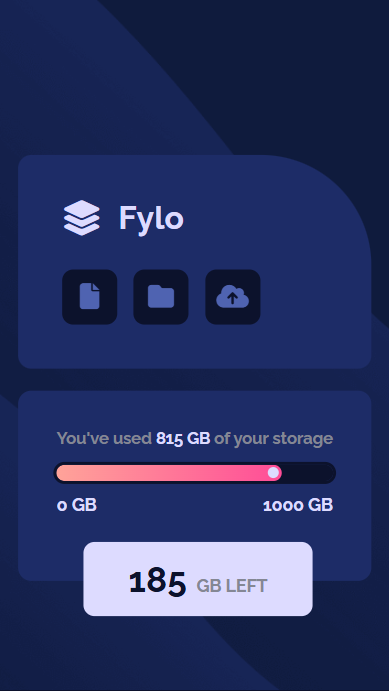
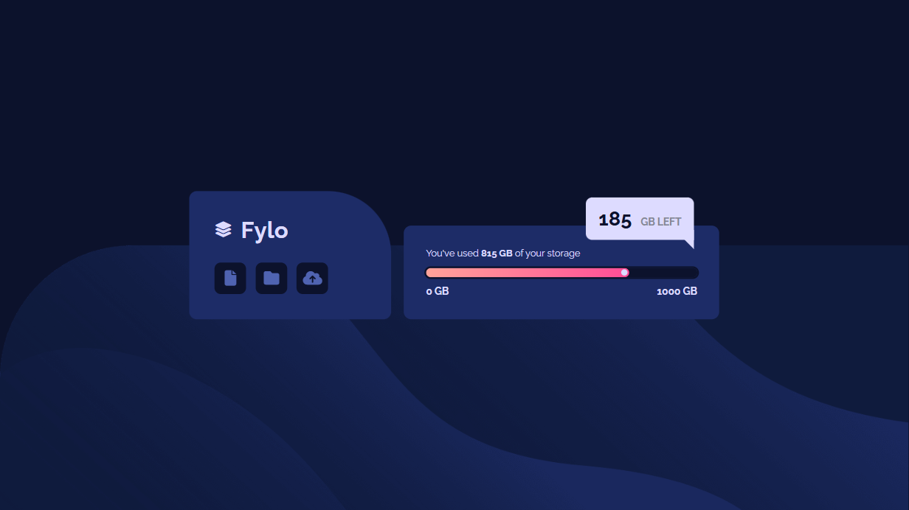

# Frontend Mentor - Fylo Data Storage Component Solution

This is a solution to the [Fylo data storage component challenge on Frontend Mentor](https://www.frontendmentor.io/challenges/fylo-data-storage-component-1dZPRbV5n).  
Frontend Mentor challenges help you improve your coding skills by building realistic projects.

---

### 📌 The Challenge

Users should be able to:

- View the optimal layout for the site depending on their device's screen size

---

### 📷 Screenshot

  

---

### 🔗 Links

- **Solution URL:** [solution URL]()
- **Live Demo:** [live]()

---

## 🛠️ My Process

### Built With

- Semantic HTML5 markup  
- CSS custom properties  
- Flexbox  

---

### 📚 What I Learned

Working on this project helped strengthen my understanding of:

- Structuring responsive components using **flexbox**
- Utilizing **CSS custom properties** to maintain consistent styling
- Organizing component-based layouts for better scalability

---

### 🚀 Continued Development

Going forward, I’d like to focus on:

- Improving animations and transitions for smoother UI interactions  
- Exploring CSS Grid for more complex layouts  
- Enhancing accessibility features  

---

### 🔍 Useful Resources

- [MDN Web Docs – Flexbox Guide](https://developer.mozilla.org/en-US/docs/Web/CSS/CSS_Flexible_Box_Layout)  
- [Frontend Mentor Community Forum](https://www.frontendmentor.io/forum)

---

## 👩‍💻 Author

- **Frontend Mentor:** [@saramx-dev](https://www.frontendmentor.io/profile/saramx-dev)  
- **Twitter:** [@saramx_dev](https://x.com/saramx_dev)  
- **LinkedIn:** [Sara Mohamed](https://www.linkedin.com/in/saramx-dev/)

---

## 🙏 Acknowledgments

Special thanks to the Frontend Mentor community for feedback and inspiration.  
If you reviewed my solution or shared insights—thank you! It truly helps me grow as a developer.

